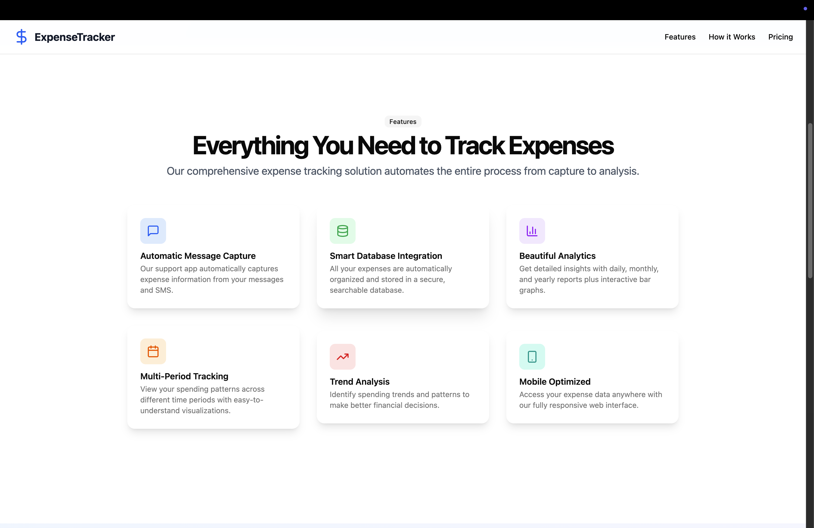

# Project Setup Guide

This README provides step-by-step instructions for setting up the environment to run the Automatic Expense Tracker

---
## 1. Settng up the backend
```
cd backend
npm install
node server.js
```
---
## 2. Settng up the web frontend
```
cd frontend
npm install
npm run dev
```
---
## 3. Settng up the Message Support App 
```
cd fronMessageSupportAppend
npm install
npx react-native run-android
```
##### Note - you need to have a physical mobile device and developers option enabled with USB debugging
---

# Automatic Expense Tracker

The Automatic Expense Tracker is a comprehensive solution designed to simplify personal finance management. It leverages a mobile message support application to automatically track expenses from your text messages and provides a powerful web-based user interface for insightful visualization and analysis of your spending habits.

---

## Key Features:

*   **Automated Expense Tracking**: Seamlessly captures expense data directly from SMS messages on your mobile device.
*   **Intuitive Web UI**: Offers a rich, interactive dashboard to visualize financial data over various periods.
*   **Spending Trend Analysis**: Understand your financial patterns with detailed graphs for the last 7 days, 12 months, or even 7 years.
*   **Top Spending Categories**: Easily identify where your money goes with categorized breakdowns.
*   **Data Export**: Conveniently download your expense data in Excel format for further analysis or record-keeping.

---

## Web UI

The web user interface provides a powerful and user-friendly platform for visualizing and managing your expenses. Gain deep insights into your spending with dynamic charts and clear data representations.

### Dashboard Overview

Visualize your total spending over different timeframes, helping you quickly grasp your financial health.





### Login and Registration

Secure access to your financial data with a streamlined login and registration process.


### Detailed Expense Views

Dive into specific periods with detailed graphs, allowing you to pinpoint spending spikes or trends.


---

### Excel File Download Support

For advanced analysis or external record-keeping, the platform offers the convenience of exporting all your expense data into an Excel file.


---

## Message Support App

The mobile message support app is the backbone of the automatic tracking feature. It intelligently parses incoming text messages (e.g., bank alerts, transaction confirmations) to extract expense details, ensuring that every transaction is recorded without manual input.


